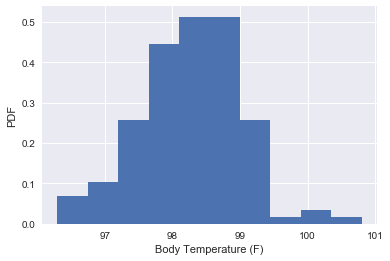

```python
import pandas as pd
import numpy as np
import matplotlib.pyplot as plt
import seaborn as sns
from scipy import stats
from scipy.stats import norm
```

```python
df = pd.read_csv('data/human_body_temperature.csv')
sns.set()
print(df.head())
```

       temperature gender  heart_rate
    0         99.3      F        68.0
    1         98.4      F        81.0
    2         97.8      M        73.0
    3         99.2      F        66.0
    4         98.0      F        73.0
    

## 1. Is the distribution of body temperatures normal? 


```python
# Begin by creating a histogram of the body temperature
_ = plt.hist(df.temperature, normed=True)
_ = plt.xlabel('Body Temperature (F)')
_ = plt.ylabel('PDF')
```





```python
# The graph seems to show a Normal distribution as suspected although it is slightly skewed to the left we can safely assume that
# the disribution is Normal.
```

## 2. is the sample size large enough? Are the observations Independent


```python
print('There are', len(df), 'samples over', len(list(df.columns)), 'variables.')
```

    There are 130 samples over 3 variables.
    

Thus, we have sufficient data to test our hypothesis

## 3. Is the true population mean really 98.6 degrees F?


```python
# Bootstrap Hypothesis
# Null hypothesis is that mean body temperature is 98.6F
# To setup a bootstrap we take the mean as our test statistic
mean_temp = df.temperature.mean()
print(mean_temp)
std_temp = df.temperature.std()
print(std_temp)
```

    98.24923076923078
    0.7331831580389454
    


```python
# bootstrap replicate function to generate replicate datasets
def bootstrap_replicate_1d(data, func, seed=1):
    np.random.seed(seed)
    return func(np.random.choice(data, size=len(data)))


def draw_bs_reps(data, func, size=1, seed=1):
    """Draw bootstrap replicates."""

    # Initialize array of replicates: bs_replicates
    bs_replicates = np.empty(size)

    # Generate replicates
    for i in range(size):
        bs_replicates[i] = bootstrap_replicate_1d(data, func, seed+i)

    return bs_replicates
```

We want to compare the sample mean to the observed population mean

#### H0: M = 98.6
#### H1: M < 98.6


```python
df_a = df.temperature.values
translated_sample = df_a - np.mean(df_a) + 98.6
```


```python
# Take bootstrap replicates of the sample population's translated temperatures: bs_replicates
bs_replicates = draw_bs_reps(translated_sample, np.mean, 10000)

# p-value: fraction of replicates that are less than the observed
p_value = np.sum(bs_replicates <= np.mean(df_a)) / 10000

print('p_value = ', p_value)
```

    p_value =  0.4911
    

None of the replicate values had a result similar to the given mean of 98.6. Thus the null hypothesis is false.


```python
# Now perform a one_sample test because we are comparing a sample group mean to the accepted population mean,
# and determining whether the sample group mean is unlikely to be found with the null hypothesis that the mean temperature equals 98.6F
# Use t-statistic because standard deviation is unknown

t_test = stats.ttest_1samp(df.temperature, popmean=98.6)
print(t_test)
```

    Ttest_1sampResult(statistic=-5.4548232923645195, pvalue=2.4106320415561276e-07)
    

We can see from the p-value that it is unlikely we would get a sample mean of 98.25 if the true mean were 98.6. In this case, we can reject the null that the mean is 98.6


```python
# To confirm this we construct a 95% confidence interval
conf_int = np.percentile(df_a, [2.5, 97.5])
```


```python
print('The 95% confidence interval is', conf_int)
```

    The 95% confidence interval is [96.7225 99.4775]
    


```python
# Now if we use z-statistic, the result will be similar because the sample size is quite large.
# As sample size increases, t ditribution approaches the standard normal z distribution.
from statsmodels.stats import weightstats as stests
z_stat = stests.ztest(df.temperature, value=98.6)
print(z_stat)
```

    (-5.4548232923645195, 4.9021570141012155e-08)
    

pvalue is less than 1% so we have reason to reject the null

## 4. Draw a small sample of size 10 from the data and repeat both frequentist tests.


```python
small_sample = draw_bs_reps(translated_sample, np.mean, 10)
```


```python
t_test_small = stats.ttest_1samp(small_sample, popmean=98.6)
print(t_test_small)
```

    Ttest_1sampResult(statistic=2.662222466033569, pvalue=0.025951103550662075)
    


```python
z_test_small = stests.ztest(small_sample, value=98.6)
print(z_test_small)
```

    (2.6622224660335685, 0.007762655490041436)
    

## 5. At what temperature should we consider someone's temperature to be "abnormal"?

From the confidence interval computed above, we can say with 95% confidence that the mean body temperature should fall between 98.47F and 98.73F

## 6. Is there a significant difference between males and females in normal temperature?


```python
# Get the number of men and women in the sample
males = df['temperature'][df.gender=='M']
females = df['temperature'][df.gender=='F']
no_male = len(males)
no_female = len(females)
print('There are', no_male, 'men.')
print('There are', no_female, 'women.')
```

    There are 65 men.
    There are 65 women.
    


```python
# Compute a t-statistics to test the difference in means between men and women
diff = males.mean() - females.mean()
std = np.sqrt(males.var()/no_male + females.var()/no_female)
t_stat_d = (diff - 0)/std
p_male = np.sum(males <= t_stat_d) / no_male
p_female = np.sum(females <= t_stat_d) / no_female
male_female_sample = stats.ttest_ind(males, females)
print(male_female_sample)
```

    Ttest_indResult(statistic=-2.2854345381656103, pvalue=0.02393188312239561)
    

Used a two-sample t-test because we are comparing the mean of the males to the mean of the females. We obtained a low p-value whihc indicates that the value observed is not by chance making it unlikely that the two samples have the same mean. Thus, there is a statistical significance not a practical significance because the difference between the two values is minute.
